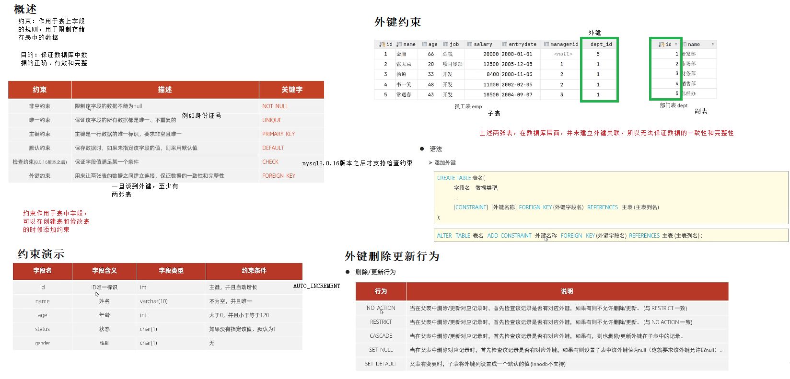
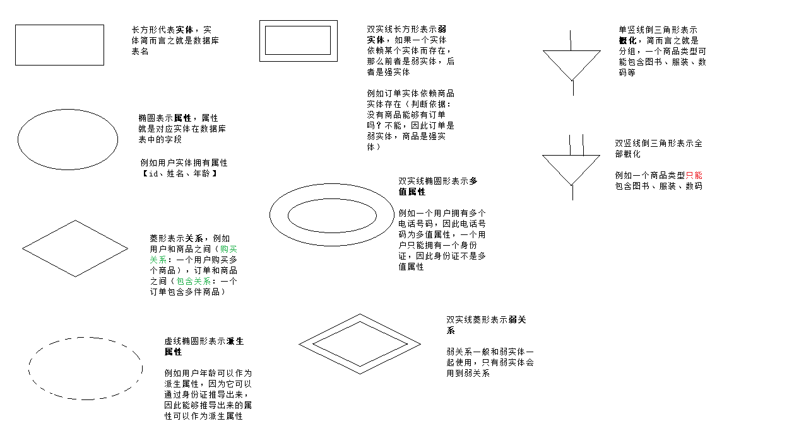

[TOC]

### DDL

### 外键

### ER图

#### 概念说明

ER图中关联关系有三种
一对一（1:1） ：1对1关系是指对于实体集A与实体集B，A中的每一个实体至多与B中一个实体有关系；反之，在实体集B中的每个实体至多与实体集A中一个实体有关系。

例如：一个用户只能拥有一张身份证，而一张身份证只属于一个用户。所以这就是一对一的关系。

一对多（1:n） ：1对多关系是指实体集A与实体集B中至少有n(n>0)个实体有关系；并且实体集B中每一个实体至多与实体集A中一个实体有关系。

例如：一对多和多对一是一样的。一个用户拥有多张银行卡，但是一张银行卡只属于一个用户。所以这就是一对多的关系。反过来说法就是多对一。

多对多（m:n） ：多对多关系是指实体集A中的每一个实体与实体集B中至少有m(m>0)个实体有关系，并且实体集B中的每一个实体与实体集A中的至少n（n>0）个实体有关系。

例如：用户与商品的关系，一个用户可拥有多件商品。同样一件商品可被多个用户所拥有。所以这就是多对多的关系。

### Power Designer使用
