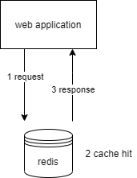

## 一、简介

Redis是一种基于内存的数据库，对数据的读写操作都是在内存中完成的，因此**读写速度极快**，应用场景如下：

- 缓存
- 消息队列
- 分布式锁
- ...

Redis提供了多种数据类型来支持不同的业务场景，例如String、Hash、List、Set、Zset（有序集合）、Bitmaps（位图）、HyperLogLog（基数统计）、GEO（地理信息）、Stream（流）。因为执行命令都是单线程负责的，不会发生并发竞争的场景，所以Redis对数据类型的操作都是**原子性**的。

在Redis中，原子性指的是一个操作要么全部完成，要么完全不执行。这种操作可以确保在多个客户端同时访问Redis时，数据的完整性和一致性。例如，如果在Redis中执行一个原子性的INCR操作，Redis会确保递增操作不会被中断或者干扰，即使多个客户端同时尝试对同一个键进行递增操作。在这种情况下，Redis会依次执行每个操作，并保证每个操作的结果是正确的。没有这种原子性的操作，多个客户端可能会同时尝试对同一个键进行修改，导致数据不一致或者丢失。

### 1.1、应用场景

Redis支持事务、持久化、Lua脚本、多种集群方案（主从复制模式、哨兵模式、切片机群模式）、发布/订阅模式、内存淘汰机制、过期删除机制等。

#### 1.1.1、MySQL缓存

由于Redis具备`高性能`和`高并发`的特性，常常使用Redis作为MySQL的缓存。例如，用户第一次访问MySQL中的某些数据，过程比较缓慢，因为这时是从硬盘中读取数据。将用户经常访问的数据缓存在Redis中，这样下一次访问这些数据的时候可以直接从缓存中读取数据。操作Redis缓存等价于操作内存，读取速度很快。

单台设备的Redis的QPS（Query Per Second、QPS）是MySQL的10倍。Redis单机的QPS可以轻松突破10w，而MySQL单机的QPS很难超过1w。

直接访问Redis能够承受的请求 >> 直接访问MySQL能够承受的请求。

因此可以将数据库中的部分数据转移到缓存中，这样用户的部分请求直接到缓存而不是经过数据库。

通过将MySQL中的数据缓存在Redis中，可以极大地提高读取数据的速度，减少从硬盘中读取数据所需要的时间和成本。但是，将MySQL中的所有数据都缓存在Redis中并不一定是最优解。缓存中存储的数据需要占用一定的内存，如果缓存中存储了太多的数据，会导致Redis内存占用过高，甚至导致系统崩溃。

因此使用Redis作为MySQL的缓存，需要考虑哪些数据需要缓存，并合理设置缓存过期时间，确保缓存中存储的数据可以及时更新，避免数据过期或者出现脏数据。

**脏数据**：脏数据指已经被缓存的数据，在缓存中被修改，但是这些修改没有同步更新到持久化存储中，导致缓存中的数据与持久化存储中的数据不一致的情况。在这种情况下，如果持久化存储出现了故障或者Redis服务器宕机，那么缓存中的数据将会丢失，因为没有同步数据到持久化存储中。为了避免脏数据的问题，可以采用Redis提供的持久化功能，将缓存中的数据定期或者实时同步到持久化设备中。同样，当更新缓存中的数据时，也需要同时更新持久化存储中的数据，保证缓存和持久化存储的数据一致性。

key-value结构数据库

- 基于内存存储，读取性能高
- 适合存储热点数据（i.e. 热点商品，咨询，新闻）

Redis的应用场景

- 缓存
- 任务队列
- 消息队列
- 分布式锁

字符串基础命令：

哈希基础命令：

列表基础命令：

集合基础命令：

有序集合基础命令：

